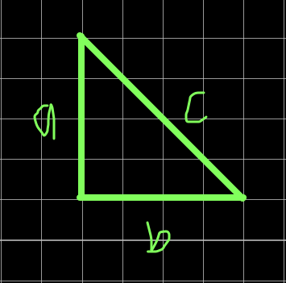

# <b> Phytagoreng </b>

Phytagoreng adalah program yang dibuat dari bahasa pemrograman LISP, yang bertujuan untuk mencari sisi miring pada segitiga siku-siku. User hanya perlu memasukkan angka-angka dari nilai sisi-sisi segitiga **(bukan sisi miring)**.

Dengan:
- a = sisi pertama
- b = sisi kedua

## <b> How to use? </b>

Untuk cara menggunakannya, ikuti langkah-langkah berikut!
1. Buka clisp.
2. Load file ini.
3. Masukkan sisi-sisi yang diminta.
4. Setelah mendapatkan hasil, anda akan disuguhkan dengan pertanyaan *Mau hitung lagi?*. 
   - Untuk melanjut menghitung lagi, tekan angka `1`. 
   - Untuk exit, tekan angka `0`
5. Selesai.

## <b>About Me</b>

I'm a student at Del Institute of Technology.  
Bachelor of Informatics study program.  

<button><a href="https://www.instagram.com/gabrielhtg77/">My Instagram</a></button>
 
<button><a href="https://www.del.ac.id/">Institut Teknologi Del</a></button>    